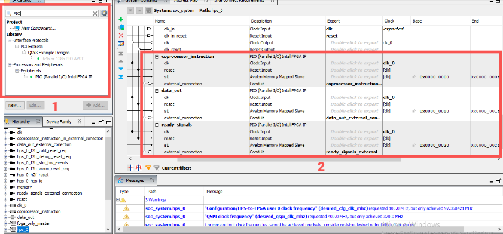

# MATRIKS: Biblioteca para coprocessador aritmético de matrizes

**Matriks** é uma biblioteca em Assembly desenvolvida para facilitar a comunicação entre o processador ARM Cortex-A9 (rodando Linux) da plataforma DE1-SoC e um coprocessador aritmético para matrizes implementado na Intel FPGA em Verilog.

O coprocessador é capaz de performar operações básicas entre matrizes quadradas de n <= 5 (operações como soma, subtração, multiplicação por escalar ou outra matriz, determinante, oposta e transposta). A biblioteca possui um conjunto de funções em Assembly que permitem ao usuário enviar dados, realizar operações e receber os resultados por meio de um mapeamento de memória.

Para obter mais informações sobre o coprocessador aritmético, acesse o [repositório](https://github.com/riancmd/matrix-coprocessor-arm-cortex-a9).

> ⚠ Caso tenha interesse exclusivo em usar a biblioteca Assembly para criar seu próprio programa utilizando o coprocessador, as informações necessárias estão em [Biblioteca](#-biblioteca). Entretanto, a lógica de tratamento das matrizes no envio foi implementada parcialmente no programa em C.

## 🚀 Sumário

* [Sobre o coprocessador](#-sobre-o-coprocessador)
* [Pré-requisitos](#-pré-requisitos)
* [Como instalar?](#-como-instalar)
* [Recursos utilizados](#-recursos-utilizados)
* [Metodologia](#-metodologia)
  * [Comunicação HPS-FPGA](#-comunicação-HPS-FPGA)
  * [Remoção de módulos desnecessários](#-remoção-de-módulos-desnecessários)
  * [Criação de novas instruções na FPGA](#-as-novas-instruções)
  * [Biblioteca](#-biblioteca)
  * [Programa principal](#-programa-principal)
* [Testes](#testes)
* [Como utilizar a biblioteca?](#como-utilizar-o-coprocessador)
* [Conclusão](#conclusão)
* [Referências](#-referências)
* [Colaboradores](#-colaboradores)

## 👨‍💻 Sobre o coprocessador
Para utilizar a biblioteca Matriks, é necessário ter o coprocessador aritmético para matrizes implementado na FPGA do kit DE1-SoC. Caso contrário, não será possível utilizá-la, pois a biblioteca depende do processamento das instruções pelo coprocessador.

O [coprocessador aritmético de matrizes](https://github.com/riancmd/matrix-coprocessor-arm-cortex-a9), desenvolvido para trabalhar em conjunto com o processador ARM Cortex A9, foi implementado em Verilog e possui toda sua documentação disponível no repositório linkado. Entretanto, junto a este repositório, há uma versão atualizada do coprocessador para trabalhar em conjunto com a biblioteca. Portanto, **a biblioteca deve ser usada junto à nova versão do coprocessador**. A versão 2.0 do coprocessador possui modificações para conserto de alguns bugs, além da adição de novos módulos para a lógica de comunicação entre o HPS (o processador) e o coprocessador na FPGA e, por fim, inserção do clock próprio da placa.

## 📄 Pré-requisitos
Para que o projeto funcione corretamente, é necessário que você tenha:

- Um **kit de desenvolvimento DE1-SoC** com FPGA Cyclone V.
- O software **Quartus Prime Lite Edition 23.1.1** instalado no seu computador.
- Uma distribui **Linux instalado e funcional no HPS** (Hard Processor System) do kit DE1-SoC.
- Conexão entre o HPS e o computador via **cabo Ethernet**.
- O **compilador GCC** já instalado no Linux do HPS (geralmente vem por padrão).

> ⚠️ Estes requisitos **devem** ser seguidos. O projeto foi desenvolvido exclusivamente para o kit DE1-SoC, cuja pinagem e arquitetura são específicas. Ele **não funciona** com outros kits ou configurações diferentes.


## 🔧 Como instalar?
### 1. Preparar o projeto

- Faça o download do projeto como arquivo `.zip` no GitHub.
- Extraia a pasta `matrix-coprocessor-arm-cortex-a9-2.0`.

### 2. Compilar no Quartus Prime

- Abra o **Quartus Prime Lite Edition**.
- Vá em **File > Open Project**.
- Navegue até a pasta extraída do projeto.
- Selecione o arquivo `soc_system.qpf` e clique em **Abrir**.
- Clique na **seta azul para a direita** ou vá em **Processing > Start Compilation** para iniciar a compilação.
- Após a compilação, vá em **Tools > Programmer**.
- Clique em **Hardware Setup** e verifique se a placa foi reconhecida.
- Carregue o arquivo `.sof` gerado.
- Clique em **Start** para programar a FPGA.

### 3. Conectar ao HPS via SSH

- Conecte o HPS ao seu computador via **cabo Ethernet**.
- Verifique o IP da placa (disponível na sua placa).
- Abra o terminal no seu computador.
- Utilize o comando SSH para acessar o HPS:
  - `ssh <seu_usuario>@<ip_do_hps>`

### 4. Transferir os arquivos para o HPS

- Certifique-se de que a pasta `src` (com `main.c` e `makefile`) e a pasta `lib` estão organizadas corretamente.
- Use um dos métodos abaixo para transferir os arquivos para o HPS:

#### Opção 1: Pelo terminal (Linux/macOS/WSL)

- Acesse o terminal no seu computador.
- Use o comando `scp` para copiar os arquivos:
  - `scp -r src lib <seu_usuario>@<ip_do_hps>:~/`

#### Opção 2: Pelo gerenciador de arquivos

- No **Linux**:
  - Abra o gerenciador de arquivos.
  - Acesse `sftp://<seu_usuario>@<ip_do_hps>` e copie os arquivos.
- No **Windows**:
  - Use programas como **WinSCP** ou **FileZilla** para realizar a transferência via SFTP.

### 5. Compilar e rodar no HPS

- Acesse o terminal do HPS via SSH.
- Navegue até a pasta `src` onde está o `makefile`.
- Compile o projeto com o comando `make compile`.
- Execute o programa com o comando `make run`.
- Siga as instruções do terminal para escolher a operação, o tamanho da matriz e digitar seus elementos.


## 📦 Recursos utilizados
### 🧩 Placa DE1-SoC

A placa DE1-SoC, baseada no SoC Cyclone V, integra um sistema de processador (HPS) com uma FPGA, permitindo projetos embarcados que combinam software e hardware dedicados.

[Manual da placa - Intel](https://www.intel.com/content/www/us/en/developer/articles/technical/fpga-academic-boards.html)

### 🛠️ Quartus Prime Lite (versões 20.1 e 23.1)

Ferramenta oficial da Intel para desenvolvimento com FPGAs. Permite a criação de circuitos digitais usando linguagens como Verilog e VHDL, com suporte a simulação, análise e programação das placas.

[Site Oficial do Software](https://www.intel.com.br/content/www/br/pt/products/details/fpga/development-tools/quartus-prime.html)

### 🐧 DE1-SoC-UP Linux

O sistema operacional DE1-SoC-UP Linux é a distribuição específica do HPS da DE1-SoC, responsável por rodar o programa que interage com o coprocessador implementado na FPGA através da biblioteca Assembly.

---

## 🔨 Metodologia
A atualização do projeto consistiu em realizar 3 etapas básicas: I - Modificações nos módulos criados no projeto 1 para acomodar os novos requisitos; II - Criação da biblioteca assembly para o processador enviar instruções ao coprocessador; III - Interface em C entre a biblioteca e o usuário.
Os subtópicos "Comunicação HPS-FPGA", "Remoção de módulos desnecessários" e "Criação de novas instruções na FPGA" elencam os passos feitos na primeira etapa, já o subtópico "Biblioteca" explica a realização da segunda etapa e por fim, o subtópico "Programa principal" corresponde a terceira etapa.

## 🗣 Comunicação HPS-FPGA
Na placa DE1-SoC existem 2 escopos principais, o HPS, contendo o processador ARMv7 e o sistema operacional Linux, e a parte do FPGA, a parte programável via Quartus. Contudo, entre essas 2 partes da placa, há uma conexão que permite enviar e receber dados, conhecida como ponte AXI, e por meio de criação de interfaces de comunicação, que correspondem a periféricos criados na FPGA, pode-se então ter controle de forma os quais dados são enviados para FPGA e lidos da FPGA através do HPS.
A criação desses periféricos ocorre através da ferramenta do Quartus *Platform Designer*, também conhecido como *QSYS*, uma ferramenta que permite criar sistemas robustos a partir da conexão personalizada de componentes de processadores, memória, periféricos, barramentos, entre outros, a partir da adição deles no ambiente de design e a configuração de como eles devem se relacionar. Dessa forma, pode criar o componente HPS referente ao processador e os periféricos de comunicação que usarão a interface AXI.
O periférico usado para essa nova etapa do projeto foi o *PIO*, *Parallel Input/Output*, que contém largura de dados de 1 até 32 bits para serem enviados do HPS para FPGA ou lidos da FPGA para o HPS. Elas ficam conectadas ao barramento AXI de interconexão, em específico, conecatado ao *LightWeight Brigde*, uma ponte AXI mais simples que permite transferir dados de 32 bits.

Para o projeto, foram usados 3 PIOs, um configurado como *Output* de 32 bits, logo o HPS envia dados para esse PIO e na FPGA, via Verilog, a saída do módulo contendo esse periférico é tratado como um sinal de entrada (Input) para os módulos criados (Control Unit), o segundo PIO foi um de 32 bits de *Input*, logo o módulo de controle possui a saída de largura de 32 bits há a conexão dos fios que saem desse módulo e entram na conexão do módulo que possuem esse segundo PIO, e por fim o terceiro PIO possui apenas 2 bits de largura, sendo configurado como *Input* e serve como bit de controle do FPGA para o HPS e bit de overflow de uma operação. Abaixo, há uma tabela contendo mais detalhes do funcionamento desses PIOs:


| **PIOs**       | **Largura** | **Endereço (offset)** | **Direção** | **Funcionalidade**                    |
|----------------|-------------|------------------------|-------------|---------------------------------------|
| `PIO_Coprocessor_Instruction`        | 32 bits      | `0x0000`                 | Output (HPS->FPGA)       | Recebe instrução da HPS contendo 16 bits para 2 números de 8 bits cada, Opcode de 4 bits, tamanho de matriz de 2 bits, posição para armazenar e ler de 4 bits e 1 bit de sinal (Os outros 5 bits são ignorados)             |
| `PIO_Data_Out`        | 32 bits      | `0x0010`                 | Input(FPGA->HPS)       | Contém 4 números de 8 bits cada que será retornados da FPGA para o HPS para serem armazenados como resultado da operação             |
| `PIO_Ready_Signals`   | 2 bits      | `0x0020`                 | Input(FPGA->HPS)         | Possui um bit de *ready* (pront0) da FPGA indicando a finalização de uma operação solicitada pela HPS e um bit indicando *overflow* da operação.      |

Uma vez configurado os PIOs no *QSYS*, gera-se então o Verilog correspondente, que é instanciado no *Top-Level* do projeto e os fios dos PIOs do módulo são conectados ao módulo de controle (Control Unit). A seguir, uma imagem da ferramenta aberta e como está configurada para o projeto:


Em "1" há a aba de ***Ip Catalog***, onde busca-se por um componente para adicionar no sistema. Uma vez adicionado, ele aparece na aba a direita, onde configura-se as conexões do componente. Em "2" há a configuração dos 3 PIOs usados para o projeto. Uma vez configurado o sistema, clica-se no menu ***Generate*** no topo da ferramenta para gerar o Verilog.

## 🚮 Remoção de módulos desnecessários
Uma vez criado os periféricos de interconexão, o próximo passo foi atualizar a unidade de controle criado no projeto 1 para acomodar as novas implementações e descartar componentes e configurações antigas.
### Remoções:
  - Foram removidos os módulos de *Interface* (Top-Level) e de memória (*Memory*) junto com os arquivos de configuração do *On-Chip-Memory* usado no projeto 1;
  - Foi removido o uso do clock sendo uma simulação através do aperto sequencial do botão na placa;
  - Alguns sinais de entrada e saída do *control_unit* foram removidas;
  - Remoção do estado de limpeza *CLN* da máquina de estados e de algumas funcionalidades não mais necessárias dentro de um estado.

### Adições
- Foi adicionado o clock de 50 Mhz da placa como sendo o clock da máquina de estados da unidade de controle - Objetivo inicial não implementado no problema 1;
- A unidade de controle recebe uma instrução de 32 bits e retorna 32 bits de dados, além dos sinais de ready e overflow já existentes;
- Acréscimo de bits na instrução: 16 bits para 2 números, 1 bit a mais para Opcode, uma vez que agora há mais 3 operações possíveis de serem realizadas, 4 bits de posição e 1 bit de start da operação;
- Adição de 3 novas operações que podem ser realizadas pelo coprocessador, que serão explicadas no próximo subtópico.

## 👩‍💻 Criação de novas instruções na FPGA
Como já mencionado a instrução agora do coprocessador possui 32 bits, 5 sendo ignorados e 27 funcionais com significado na decodificação, a nova estrutura ficou da seguinte forma:

| **Posição dos Bits** | **Significado**                      |
|----------------------|--------------------------------------|
| [0]                  | Sinal de start da operação           |
| [4:1]                  | Posição para escrever ou ler no buffer(registrador)|
| [6:5]                  | Tamanho da matriz       |
| [10:7]                  | Opcode da operação                 |
| [26:11]                  | Números A e B (8 bits cada)            |

Além disso, foi adicionado 3 novas operações: **STORE_MATRIX1**, **STORE_MATRIX2** e **LOAD_MATRIXR**. Sendo as 2 primeiras responsáveis de armazenar 2 números contidos no campo de números da instrução na posição dada pelo campo *Position* da instrução dentro do buffer, que é um registrador de 200 bits, um registrador para matrizA e um para matriz B. Já a instrução de load usa a posição para ler de um buffer/registrador de 200 bits que armazena o resultado da operação, e com base na posição retorna 32 bits (4 números de 1 byte) para o HPS através do PIO correspondente. A tabela a seguir apresenta como cada Opcode trabalha com os outros campos da instrução.


| **OPCODE** | **Operação**                | **Números A e B**                                   | **Tamanho da Matriz**                                                             | **Posição**                                                | **Funcionalidade**                                                                                  |
|------------|-----------------------------|-----------------------------------------------------|------------------------------------------------------------------------------------|-------------------------------------------------------------|------------------------------------------------------------------------------------------------------|
| `0000`     | Soma                        | Não usa esse campo                                  | Não usa esse campo                                                                 | Não usa esse campo                                           | Soma de duas matrizes                                                                                |
| `0001`     | Subtração                   | Não usa esse campo                                  | Não usa esse campo                                                                 | Não usa esse campo                                           | Subtrai matriz A da matriz B                                                                        |
| `0010`     | Multiplicação de matrizes   | Não usa esse campo                                  | Não usa esse campo                                                                 | Não usa esse campo                                           | Multiplica matrizes A e B                                                                           |
| `0011`     | Multiplicação por inteiro   | Não usa esse campo                                  | Não usa esse campo                                                                 | Não usa esse campo                                           | Multiplica matriz A por um inteiro                                                                  |
| `0100`     | Determinante                | Não usa esse campo                                  | Usa para decidir qual determinante usar (Det2x2, Det3x3, Det4x4 ou Det5x5)         | Não usa esse campo                                           | Calcula a determinante da matriz com base no tamanho                                                |
| `0101`     | Transposta                  | Não usa esse campo                                  | Não usa esse campo                                                                 | Não usa esse campo                                           | Calcula transposta da matriz A                                                                      |
| `0110`     | Oposta                      | Não usa esse campo                                  | Não usa esse campo                                                                 | Não usa esse campo                                           | Calcula oposta da matriz A                                                                          |
| `0111`     | Store_matrix1               | Usa para guardar 2 valores                          | Não usa esse campo                                                                 | Usado para guardar os números em certo offset do buffer/registrador     | Salva os 2 números no campo da instrução em certo offset dado pelo campo da posição dentro do registrador da matriz A |
| `1000`     | Store_matrix2               | Usa para guardar 2 valores                          | Não usa esse campo                                                                 | Usado para guardar os números em certo offset do buffer/registrador     | Salva os 2 números no campo da instrução em certo offset dado pelo campo da posição dentro do registrador da matriz B |
| `1001`     | Load_matrixR                | Não usa esse campo                                  | Não usa esse campo                                                                 | Usado para ler os bits armazenados no buffer/registrador com base no offset da posição       | Retorna para HPS 32 bits presentes no registrador de resultado com base no offset dado pelo campo da posição          |


## 📚 Biblioteca
A biblioteca `Matriks` foi escrita em Assembly para ARMv7 e serve como interface entre o processador (HPS) da DE1-SoC e o coprocessador de operações com matrizes implementado em Verilog na FPGA . Ela abstrai os detalhes da comunicação com a FPGA e fornece um conjunto de funções que facilitam o envio e o recebimento de dados, bem como o controle das operações aritméticas.

A criação da biblioteca foi baseada nas PIOs presentes no projeto do coprocessador no Quartus, explicadas alguns [tópicos acima](#-comunicação-HPS-FPGA), mapeando os registradores da FPGA na memória virtual do Linux através do /dev/mem.

### 🔧 Como funciona a biblioteca?

A biblioteca realiza, em geral, 6 ações, incluindo: inicializar o mapeamento de memória, enviar instruções, enviar um sinal de início de operação, receber os dados do coprocessador, verificar situações de overflow e desmapear a memória. Abaixo, uma breve descrição de cada etapa:

1. **Inicialização**: Mapeia os registradores da FPGA na memória virtual do Linux, através de `/dev/mem` (utilizando a função start_program).
2. **Envio de dados**: Envia pares de valores inteiros (elementos da matriz ou dados intermediários) para a FPGA.
3. **Início da operação**: Aciona o coprocessador para realizar a operação desejada (soma, subtração, multiplicação, etc.).
4. **Recebimento dos resultados**: Lê os dados processados de volta para o HPS.
5. **Verificação de overflow**: Verifica se houve overflow durante o processamento.
6. **Finalização**: Desfaz o mapeamento de memória e encerra o uso da biblioteca.

---

### 📌 Funções disponíveis

- **`start_program`**  
  Faz o mapeamento de memória necessária para acessar os registradores da FPGA. Deve ser chamada antes de qualquer outra função. Sem mapear a memória, não é possível enviar instruções.

- **`exit_program`**  
  Libera os recursos alocados e encerra o uso da biblioteca. É utilizada apenas ao encerrar o programa. 

> :warning: É importante desmapear a memória para não obter comportamentos inesperados na execução da biblioteca.

- **`operate_buffer_send(opcode, size, pos, buffer_ptr)`**  
  Envia uma instrução ao coprocessador junto com dois operandos de 8 bits, que devem estar armazenados consecutivamente no endereço apontado por `buffer_ptr`, além do tamanho da matriz nxn e a posição no array de dados (no endereço apontado). Essa função é usada para preencher o buffer interno com dados das matrizes.

> :warning: As matrizes são calculadas sempre como sendo 5x5. Entretanto, a função envia apenas 32bits por limitações físicas da placa. Dessa forma, qualquer tratamento para envio de matrizes, caso não utilize o programa conjunto, deve realizar o tratamento adequado. Mais informações estão disponíveis no [programa principal](#-programa-principal).

- **`calculate_matriz(opcode, size, pos)`**  
  Inicia a operação no coprocessador com base nos parâmetros informados anteriormente em operate_buffer_send. Essa função **não** envia dados, apenas envia um sinal de início de operação.

- **`operate_buffer_receive(opcode, size, pos, buffer_ptr)`**  
  Solicita ao coprocessador o resultado de uma operação. O resultado (32 bits) será armazenado nos 4 bytes a partir do endereço indicado por `buffer_ptr`, seguindo a posição apontada. Como o resultado sempre é enviado como matriz 5x5, o tratamento do recebimento de dados também deve ser tratado adequadamente no programa em C.

- **`signal_overflow()`**  
  Verifica se houve overflow na última operação. Retorna 1 em caso de overflow e 0 caso contrário.

### Tabela compacta de funções
| Função                    | Argumentos                          | Bits por Argumento (Total) | Descrição                                                                 |
|---------------------------|-------------------------------------|----------------------------|---------------------------------------------------------------------------|
| `start_program`           | `void`                              | -                          | Inicializa o programa e mapeia os endereços dos PIOs                      |
| `exit_program`            | `void`                              | -                          | Finaliza o programa e desmapeia a memória                                 |
| `operate_buffer_send`     | `(opcode, size, position, matriz)` | **Instrução (32 bits):**<br>- 8 bits N1<br>- 8 bits N2<br>- 4 bits Opcode<br>- 2 bits Size<br>- 3 bits Position<br>- 1 bit Start<br>- 6 bits não utilizados | Envia 2 elementos da matriz por vez para o coprocessador                  |
| `calculate_matriz`        | `(opcode, size, position)`         | **Instrução (32 bits):**<br>- 4 bits Opcode<br>- 2 bits Size<br>- 3 bits Position<br>- 1 bit Start<br>- 22 bits não utilizados | Inicia uma operação matricial no coprocessador                            |
| `operate_buffer_receive`  | `(opcode, size, position, matriz)` | **Retorno (32 bits):**<br>- 4 valores de 8 bits cada (total 32 bits)       | Recebe 4 elementos da matriz resultante por vez do coprocessador          |
| `signal_overflow`         | `void`                              | **Sinal (1 bit):**<br>- 1 bit Overflow (bit 0 do PIO3)                    | Verifica se ocorreu overflow na última operação                           |

---

### ✏️ Exemplo de uso

```C
    // envia os dados com o opcode
    temp_pos = matrixA;
    for (i=0;i<13;i++){
        flagOK1 = operate_buffer_send(storeMatrixA, (size-2), i, temp_pos);
        temp_pos += 2;
    }
```


## 💻 Programa principal
### Visão Geral
O programa principal (`main.c`) atua como a interface de usuário para a biblioteca Matriks, permitindo operações matriciais através do coprocessador aritmético implementado em Verilog. O código é escrito em C e faz chamadas para a biblioteca em Assembly que, por sua vez, serve como ponte entre o HPS (Hard Processor System) e o coprocessador.

A lógica aqui implementada trata os dados das matrizes antes de enviá-los às funções em Assembly. 

> :warning: As matrizes são nxn com **apenas** números de 1 byte com sinal (ou seja, entre -128 e 127). Isso se dá pela arquitetura do coprocessador, que tem um limite de 8 bits.

### `Função main()`
* Inicializa o programa chamando showMenu(), que exibe informações visuais sobre a biblioteca e permite entrada de dados do usuário. As funções showMenu() e as demais foram implementadas na biblioteca functions.c e prototipadas em functions.h.

### `Função showMenu()`
* Aloca memória suficiente para as matrizes e demais variáveis temporárias;
* Cria um loop de menu, exibindo opções e permitindo entrada do usuário.

### `Função menuOperation()`
* Função crítica no processamento dos dados das matrizes. Ela recebe os ponteiros para as matrizes e matriz resultante e seleciona entre as 7 operações disponíveis;
* O tratamento de dados utiliza uma lógica que preenche a matriz 5x5 correspondente às matrizes menores com 0s onde não haveria dados. Dessa forma, os dados são uniformizados e apenas um tipo de loop é criado no programa;
* Assim, o envio e recebimento de dados utiliza for loops que iteram, respectivamente, 13 e 7 vezes para enviar e receber matrizes. O envio é de 2 em 2 bytes. O recebimento é de 4 em 4 bytes.

## Testes
Inicialmente, os testes realizados buscaram verificar o mapeamento de memória utilizando as PIOs. Para isso, um módulo somador de teste foi utilizado. Esse módulo buscava abstrair o coprocessador aritmético numa simples unidade lógico-aritmética que realizava a operação única de soma. Eram utilizadas menos PIOs do que no projeto atual, no total de 2: Um PIO de 17 bits contendo os 2 números de 8 bits cada e um sinal de start que o HPS mandava e um PIO de 9 bits lido pelo HPS contendo o resultado da soma e o sinal de ready. O objetivo desse teste foi testar e entender o funcionamento dos PIOs e do mapeamento dos endereços do AXI e dos PIOs em assembly, assim foi criado um código apenas em assembly que lia do teclado 2 valores, fazia o mapeamento, mandava para a FPGA e mostrava no terminal o resultado. Esse teste foi importante para dar seguimento ao projeto e o código em assembly pode ser visto na pasta *src/testbench*.

Os testes procederam-se com as funções start_program, exit_program e uma versão inicial das funções de envio e recebimento. Primeiro foi feito um código em C simples sem a interface para o usuário, realizando a chamada do procedimento de start_program e verificando se ocorria com êxito. Uma vez testado esse procedimento, foram testados os de envio e recebimento inicial apenas com uma matriz 2x2, onde os valores da matriz eram predefinidos no próprio código em C e usada um código assembly simples inicial dos procedimentos de envio e recebimento de dados apenas considerando matriz 2x2. Com o êxito desse teste, foram feitas as modificações para usar sempre matrizes 5x5 para envio e recebimento e foi usado a interface em C para o usuário para os testes finais. 

## Como utilizar a biblioteca?
Para utilizar a biblioteca `matriksLib.s` no seu projeto, siga estes passos: 
* **1) Monte** o código Assembly com `as -c lib/matriksLib.s -o lib/matriksLib.o`
* **2) Compile** seu código C (e `functions.c` se necessário) com a flag `-I./lib` para incluir o diretório da header (`gcc -c main.c -o main.o -I./lib`)
* **3) Linke** todos os objetos (`matriksLib.o`, `functions.o` e `main.o`) com `gcc -o main`.

A header `matriksLib.h` fornece os protótipos das funções Assembly (como `operate_buffer_send()` e `calculate_matriz()`), permitindo chamá-las diretamente do C após a vinculação. O Makefile do projeto já automatiza esse processo com os targets `compile` e `run`, então é possível, também, apenas modificar o makefile para incluir seu projeto ao invés da "main.c". Ou, também, criar um novo makefile.

## Conclusão
A biblioteca `Matriks` tem um alto potencial de uso junto ao coprocessador aritmético de matrizes, especialmente em aplicações para computação visual ou inteligência artificial, além de muitas outras possibilidades. Ela permite que o processamento de dados seja feito num coprocessador exclusivo que, futuramente, pode ser expandido para abarcar uma maior capacidade no aspecto do hardware.

## 📚 Referências
* Patterson, D. A. ; Hennessy, J. L. 2016. Morgan Kaufmann Publishers. Computer organization and design: ARM edition. 5ª edição.

* INTEL CORPORATION. Intel 8087 Numeric Data Processor: User’s Manual. Disponível em: https://datasheets.chipdb.org/Intel/x86/808x/datashts/8087/205835-007.pdf. 

* INTEL CORPORATION. Qsys System Design Tutorial. Disponível em: https://www.intel.com/content/www/us/en/docs/programmable/683378/current/qsys-system-design-tutorial.html

* ARMV7 Quick Reference. Disponível em: https://courses.cs.washington.edu/courses/cse469/20wi/armv7.pdf

## 👥 Colaboradores
* **Rian da Silva Santos** -  [Rian](https://github.com/riancmd)
* **Victor Ariel Matos Menezes** - [Victor](https://github.com/VitrolaVT)
