# Coprocessador Aritmético para Operações Matriciais
#### MI de Sistemas Digitais(TEC499) - TP02

## 🚀 Sumário

* [Introdução](#-introdução)
* [Pré-requisitos](#-requisitos)
* [Como instalar?](#-como-instalar)
* [Requisitos do problema](#-requisitos-do-problema)
* [Recursos utilizados](#-recursos-utilizados)
* [Metodologia](#metodologia)
  * [Unidade de controle](#-unidade-de-controle)
  * [Memória](#-memória)
  * [Unidade Logico Aritmética](#-unidade-lógico-aritmética)
* [Testes](#-testes)
  * [Como realizar testes?](#-como-realizar-testes)
* [Como utilizar o coprocessador?](#-como-utilizar-o-coprocessador)
* [Conclusão](#-conclusão)
* [Referências](#-referências)
* [Colaboradores](#-colaboradores)

## 🧠 Introdução
Os computadores possuem como um dos seus componentes principais e um dos mais conhecidos o **processador** (CPU - Central Processing Unit), que realizará o controle de dados que chega e saem em seu sistema, os processos de instruções, a devida sinalização para outros componentes dos próximos passos a serem executados.

Contudo, muitas operações e cálculos existem muito poder de processamento, o que pode sobrecarregar a CPU e fazer com que o sistema em geral fique mais lento em seus processos. Devido a isso, surge a ideia do **coprocessador**, uma unidade de processamento que depende da CPU e serve para realizar operações específicas de forma mais eficiente, retirando esse peso do processador, tendo como exemplo as GPUs (Graphics Processing Unit).

Diante dessa abordagem, foi solicitado aos alunos da disciplina TEC499 (Sistemas Digitais) da Universidade Estadual de Feira de Santana, a criação de um coprocessador aritmético que realizará operações envolvendo matrizes quadradas, usando a placa **DE1-SoC** e a linguagem de descrição de hardware **Verilog**

# 📋 Requisitos
É necessário ter em mãos um kit de desenvolvimento DE1-SoC. Também é necessário possuir o Quartus Prime Lite Edition 23.1.1 instalado no seu dispositivo para implementar o coprocessador na placa e realizar a comunicação.

Os requisitos anteriores **devem** ser seguidos, pois é limitação do código a pinagem estar estabelecida para o kit de desenvolvimento DE1-SoC Cyclone V. Além disso, os ciclos de clock são realizados manualmente através do botão `00`, presente no kit.

# 🔧 Como instalar?
* Faça o download do projeto como arquivo `.zip` e extraia a pasta matrix-coprocessor-arm-cortex-a9.
* Abra o **Quartus Prime**.
* Vá em **File** > **Open Project**.
* Encontre o arquivo `matrix-coprocessor-arm-cortex-a9.qpf` na pasta que você extraiu do GitHub.
* Selecione-o e abra.
* Com o projeto aberto, clique no botão que é uma seta azul para a direita, para iniciar a compilação, ou vá em **Processing** > **Start Compilation**.
* Vai em **Tools** > **Programmer**.
* Clique em Hardware Setup pra garantir que o Quartus achou sua placa.
* Depois, carregue o arquivo `.sof` gerado e clique em **Start**.

## 📌 Requisitos do Problema
O problema exige um coprocessador que será capaz de realizar cálculos intensivos com matrizes, diante das aplicações que utilizam essas abordagens de operações com matrizes, como processamento de imagens, aprendizado de máquina, criptografia, entre outros. Assim os requisitos estipulados foram:
* Hardware do coprocessador descrito usando **Verilog**
* Recursos de hardware limitados aos da placa **DE1-SoC**
* Operações com matrizes quadradas de 2x2 até 5x5
* Elementos da matriz representados por binário com largura de 8 bits e com bit MSB de sinal
* Operações básica entre matrizes:
  * Adição
  * Subtração 
  * Multiplicação entre matrizes
  * Multiplicação de matriz por escalar
  * Cálculo de determinante
  * Transposição 
  * Oposta de matriz
   
## 🧰 Recursos utilizados
* ### Placa DE1_SoC
A placa DE1_SoC, da família Cyclone V possui tanto uma divisão HPS(Hard Processor System) quando a parte **FPGA**, está ultima sendo a parte programavél que receberá a descrição do hardware do projeto e possuirá a memória.

[Manual da placa](https://www.intel.com/content/www/us/en/developer/articles/technical/fpga-academic-boards.html)

* ### Quartus Prime Lite 20.1 e 23.1
Software que permite criar códigos em linguagem de descrição de máquina, a destacar para o projeto, o verilog, além de disponibilizar diversos recursos de depuração, simulação, otmização, entre outros, usados no processo de criação do coprocessador.

[Site Oficial do Software](https://www.intel.com.br/content/www/br/pt/products/details/fpga/development-tools/quartus-prime.html)

* ### Icarus Verilog
O Icarus verilog é um compilador open-source da linguagem verilog, que disponibiliza uma maneira fácil de realizar testes (**testbench**) a módulos individuais do sistema, sem necessitar o uso da placa física ou outros modos mais complexos de simulação.

[Link de Download](https://bleyer.org/icarus/)

* ### Github 
O Github é a plataforma que hospeda códigos através dos repositórios - e por onde você está tendo acesso a esse projeto - permitindo que uma equipe trabalhe no mesmo projeto e use a ferramenta Git para versionar o código principal sem comprometer todo o projeto

## 🛠️ Metodologia
Para o desenvolvimento do projeto, foi necessário entender primeiramente o que seria um coprocessador, como ele funciona de forma eficiente, seguido de como ele executa as operações que foram selecionadas e como ele consegue tanto pegar essas dados das matrizes, como retornar o que foi pedido.

Uma vez estudado a partir de **bibliografias** confiáveis as características que representam o coprocessador foi elencando os seguintes pontos cruciais:

* Os processadores e coprocessadores contam com uma unidade elemental que realiza o controle do fluxo de dados (bits), observando através de elementos chamados **registradores** o que esses bits significam e o que deverá ser feitos com eles. Essa unidade é a **Unidade de controle**, que será descrita adiante.

* As operações ocorrem a depender do sinal ou sinais de controle da Unidade de controle, e elas ficam organizadas dentro de uma outra unidade que depende de barramentos de dados vindo dos registradores do coprocessador. Essa unidade é a **ULA: Unidade Lógico Aritmética**

* As instruções que o coprocessador recebe em sua unidade de controle, juntamente com dados das matrizes, vem sempre da **memória** para os **registradores** internos, e saem dos **registradores** para a **memória** quando estão prontos para serem mostrados.

## 🔹 Unidade de controle
A unidade de controle descreve um design de arquitetura que será responsável pelo controle de fluxo de dados como já foi comentado. Esse design mostra um conceito que todos os processadores usam para funcionar corretamente, onde ele passa do pressuposto que é necessário **ler** informações, **decodificá-las** para entender o significado da instrução que chegou, **executar** de fato a instrução, **retornar** os dados e **esperar** por uma nova leitura.

Percebe-se então que esta unidade é uma **Máquina de Estados Finitos (MEF)**, onde o nome do estado de leitura é o **Fetch (busca)**, de decodificação é o **Decoder**, da execução da instrução **Execute** e da escrita na memória, retornando o resultado, **WriteBack**

Portanto, o módulo de controle do projeto foi criado levando em conta esses 4 estados base, o que resultou na arquitetura a seguir

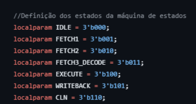

* **IDLE:** Estado inicial de espera, serve para definir qual o endereço, armazenado no registrador **adrss** de 2 bits, certo da memória deve-se iniciar, além de definir o estado de alguns sinais de controle, como o **wren (Write Enable)**, um sinal que indica se deve escrever dados no endereço, que nesse caso é 00;

* **FETCH1:** Estado que lê da memória a **instrução** no endereço 00, de forma que os dados lidos ficam armazenados nos registradores internos **opcode_reg** → Código da operação e **msize_reg** → Tamanho da matriz, além de definir que o endereço agora é 01;

* **FETCH2:** Estado que lê da memória os elementos da **matriz 1** no endereço 01 e armazena no registrador **matrix1_reg**, além de mudar o endereço para 10;

* **FETCH3_DECODE:** Estado que lê da memória os elementos da **matriz 2** no endereço 10 e armazena no registrador **matrix2_reg**, além de mudar o endereço para 11;

* **EXECUTE:** Estado que analisa/decodifica o **opcode_reg** e com base em seu valor, armazena o resultado ou matriz resultante da operação encontrada no registrador **result_reg**, que será posteriormente armazenado na memória;

* **WRITEBACK:** Estado que define o **wren** para 1, indicando que será escrito uma informação do **result_reg** para memória e no endereço 11, utilizando 3 ciclos de clock para tal, além de mandar um sinal indicando que a operação foi feita com sucesso;

* **CLN:** Estado de **Clean Up**, um estado a mais de lipeza necessário para limpar alguns registradores, os definindo como valor 0. Isso é necessário para evitar que alguns sinais resultantes e registradores usados continuem com o valor de uma operação já realizada. 

## 💽 Memória
Como já dito, é necessário **ler** da memória e **escrever** na memória. Para tal, a placa DE1_SoC, especificamente falando da parte da FPGA, possui uma memória interna que pode ser utilizada na arquitetura completa do projeto.

Para acessá-la bastar ir no ambiente Quartus: **View ➜ Utilitiy Windows ➜ IP Catalog**. Após isso no canto direito do Quartus, segue de **Library ➜ Basic Functions ➜ On Chip Memory ➜ RAM: 1-PORT**

Com isso, uma nova janela se abrirá, como na imagem abaixo:

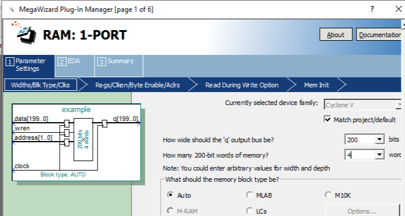

Na qual foi configurado para o projeto uma saída de 200 bits por endereço e 4 **Words**, que significam a quantidade de endereço para o projeto. Uma vez inicializado essa memória RAM, basta instanciar o módulo gerado dentro do escopo da unidade de controle. O módulo pode ser visto abaixo:

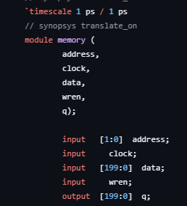

* **clock** ➜ a entrada de clock do módulo;
* **data** ➜ entrada de dados para serem escrito na memória, que para o coprocessador criado, representa o resultado (result_reg);
* **address** ➜ entrada do index do endereço (00 até 11);
* **wren** ➜ entrada do sinal indicando escrita ou leitura;
* **q** ➜ saída com a array de bits (200) lida da memória

## ➕ Unidade Lógico Aritmética

Por fim, a último parte do coprocessador versa sobre como as operações entre matrizes são realizadas. A **ULA**, Unidade Lógico Aritmética, é composto por um total de 12 módulos distintos dedicados as todas as operações descritas nos [requisitos](#requisitos-do-problema), sendo 10 desses módulos dedicados as operações propriamente ditas e 2 para operações intermediárias que são feitas dentro de alguns módulos. Esses módulos são instanciados dentro da **unidade de controle**, e suas entradas e saídas são configuradas adequadamente para o perfeito funcionamento do coprocessador, o que resultou em uma aplicação de **paralelismo**, onde as operações ocorrem ao mesmo tempo, e o registrador do resultado final apenas recebe o resultado advindo do módulo da operação com base no **opcode**.

A codificação dos bits do registrador usado para armazenar o código de operação se enconra abaixo:

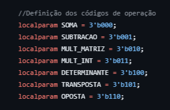

### SOMA
O processo de adição de matrizes ocorre através do módulo **add_M.v**, um módulo que recebe como entrada uma array de 40 bits para representar uma linha (que por padrão tem número máximo de 5 elementos, logo 40 bits) da matriz 1 e outro array de 40 bits para representar a linha correspondente da matriz 2, além de outros sinais de controle como o **rst(reset dos valores internos do módulo)**.

O módulo então realiza a soma dos elementos correspondentes entre cada linha de entrada, através da notação que identifica o deslocamento para cada elemento da matriz, que por padrão é 8. Portanto, o primeiro elemento de cada linha são os 8 bits **mais** significativos (MSB) da linha ➜ bit 39 até 32 . O próximo elemento então inicia do bit 31 até 24 devido o deslocamento de 8 bits, e segue esse padrão até o último número da linha.

Essa soma então é armazenada num registrador temporário que divide cada intervalo de sua extensão para acomodar corretamente os elementos resultantes, que será atribuído a saída do módulo com extensão de 40 bits.

Como esse módulo recebe uma linha de cada matriz por vez, é necessário 5 instâncias para acomodar o caso máximo de matriz 5x5.

#### ➜ Tratamento de Overflow
Como os elementos são armazenados em números inteiros binários de até 8 bits com o bit MSB indicando sinal do número - o que resulta em representação binária dos números decimais -128 até 127 - somas que extrapolem essa extensão não são permitidas, o que faz sinalizar **overflow**.
Para o tratamento disso, o registrador temporário da soma possui uma extensão maior de bits, de modo a acomodar o possível bit de overflow para soma entre cada um 5 dos elementos de uma linha com o correspondente da linha da matriz 2. Por fim, compara esse bit adicional com o último bit do elemento, se forem distintos, há sinalização de overflow.

### SUBTRACAO
Realiza a operação de subtração através do módulo **sub_M.v**, que funcione de forma semelhante a adição, recebendo 2 linhas de 40 bits, realizando a soma entre os elementos correspondentes de cada linha através do cálculo do deslocamento (8 bits) e armazenando no registrador temporário, que por sua vez será atribuído, considerando apenas os 8 bits de cada elemento, a saída de 40 bits.

Como esse módulo recebe uma linha de cada matriz por vez, é necessário 5 instâncias para acomodar o caso máximo de matriz 5x5.

#### ➜ Tratamento de Overflow
O tratamento de **overflow** ocorre de forma semelhante ao tratamento no módulo de adição, comparando o bit de overflow adicional com o bit MSB real do elemento. 

### MULT_MATRIZ 
A multiplicação envolvendo matrizes é feita através do módulo **mult_M.v**, que recebe uma array de 80 bits, sendo os 40 primeiros bits representando uma linha de uma matriz e os outros 40 a outra linha da mesma matriz. Já o outro *input* é também de 80 bits, porém agora as 2 divisões de 40 bits representam cada uma coluna da matriz 2. Como há 2 linhas e 2 colunas, esse módulo gera um resultado de 32 bits, acomodando 4 elementos resultantes da multiplicação de matrizes, esse resultado é então fatiado na **unidade de controle** para armazenar cada elemento em sua devida posição do registrador do resultado.

Esse módulo ainda usa 4 instâncias de um módulo intermediário, chamado **[intProd_M.v](#módulo-intprod_m.v)**, que faz a operação de multiplicação matricial usando como base uma linha de uma matriz e a coluna da próxima matriz, gerando o elemento resultante e o sinal de overflow.

Como esse módulo recebe 2 linhas de uma matriz e 2 colunas da outra por vez, é necessário 7 instâncias para acomodar o caso máximo de matriz 5x5, onde há instâncias que só recebem uma linha e/ou uma coluna.

#### ➜ Tratamento de Overflow
O tratamento de **overflow** ocorre captando os sinais de overflow de cada instância do módulo **intProd_M**

### MULT_INT 
Já a multiplicação por escalar ocorre através do módulo **mult_MI.v**, que recebe uma linha de 40 bits e uma array de 8 bits que representa a escalar, gerando um resultado de 40 bits contendo os 5 elementos resultantes dessa multiplicação por escalar. 

Este módulo também usa um módulo intermediário, o **[multiplier.v](#módulo_multiplier)**, no total de 5 instâncias. Este módulo realiza a operação de multiplicação de 2 números de 8 bits, gerando o resultado em 8 bits e os sinais de overflow.

#### ➜ Tratamento de Overflow
O tratamento de **overflow** ocorre captando os sinais de overflow de cada instância do módulo **multiplier**

### DETERMINANTE 
Para o cálculo de determinantes, foram criados 4 módulos para cada caso do tamanho da matriz: 2x2, 3x3, 4x4 e 5x5, resultando nós módulos:

* **det2.v:** Que recebe 2 linhas de 16 bits cada e faz o cálculo conhecido de determinante de matriz 2x2, resultando num valor de 8 bits;
* **det3.v:** Que recebe a matriz completa em uma array de 72 bits, e utiliza 12 instâncias do módulo **[multiplier.v](#módulo_multiplier)**, para cada uma das 12 multiplicações internas existentes no cálculo de determinante 3x3 pelo **método de Sarrus**;
* **det4.v:** Que recebe 128 bits representando toda a matriz 4x4. Para o cálculo da determinante 4x4 foi usado o **método de Laplace**, de modo que o módulo usa 4 instâncias do módulo **det3.v** para calcular os determinantes de matrizes 3x3 intermediários e 4 instâncias do módulo **multiplier**, para as multiplicações com um elemento da matriz 4x4 e o determinante da matriz 3x3 interna correspondente.

* **det5.v:** Que recebe os 200 bits que representam toda a matriz 5x5, e seu funcionamento é semelhante ao determinante anterior: usa 5 instâncias do módulo **det4.v** e do módulo **multiplier**.

#### ➜ Tratamento de Overflow
O tratamento de **overflow** para matriz 2x2 ocorre comparando o valor do **registrador temporário** de 17 bits - tamanho necessário para acomodar multiplicação entre 2 números de 8 bits seguido de uma subtração por outro valor resultante de Multiplicação com 8 bits - com os valores máximos possíveis de serem representados com 8 bits de extensão e com representação de sinal ➜ -128(11111111) até 127(01111111).

O tratamento de **overflow** dos outros determinantes usa os sinais de indicação de overflow vindo dos módulos internos instanciados e da comparação do valor dos registradores temporários com os valores máximos previstos.

### TRANSPOSTA 
O processo de transposição, ou seja, troca das linhas com as colunas da matriz, é relativamente simples, não havendo um módulo dedicado: Primeiro reserva **registradores intermediários** de 40 bits para acomodar a transformação da coluna em linha ➜ sabendo o deslocamento necessário para localizar cada elemento de uma coluna, realiza o processo de **concatenação**, que serve para juntar seqúencias de bits em uma só ➜ armazena a linha concatenada no registrador correspondente ➜ o registrador resultado que será escrito na mémoria recebe os registradores intermediários.

#### ➜ Tratamento de Overflow
Nessa operação não há overflow.

### OPOSTA 
A inversão de uma matriz ocorre através do módulo **opp_M.v**, que recebe uma linha de uma matriz em um array de 40 bits e realiza a multiplicação de cada um dos 5 elementos presentes por -1, armazenando valor em um registrador temporário de 40 bits para ser enviado para saída.

Como esse módulo recebe uma linha de cada matriz por vez, é necessário 5 instâncias para acomodar o caso máximo de matriz 5x5.

#### ➜ Tratamento de Overflow
Só existe um caso de overflow para operação de inversão: quando há algum elemento da array da linha dada que represente o valor -128, uma vez que sua inversão resultaria em 128, um valor que foge dos limites do projeto. Assim verifica-se cada elemento individualmente para sinalizar **overflow** quando no mínimo 1 deles represente -128.

## Módulos intermediários
#### ➜ Módulo intProd_M.v
Módulo usado para calcular **produto interno** de uma linha de uma matriz pela coluna da outra, de modo a gerar um valor com  8 bits que será o elemento posicionado no mesmo índice da linha de entrada e mesmo índice da coluna de entrada.

Ela instâncias 5 vezes o módulo **[multiplier.v](#módulo_multiplier)** e verifica as 5 saídas de overflow geradas pelas instâncias.

#### ➜ Módulo multiplier.v
Módulo **base** de todo processo de **multiplicação**, usado para revolver o problema de estouro de **DSP(Digital Signal Processing)**, que ocorre quando operações de multiplicações são descritas usadas o operador nativo do **verilog** \*. 

A compilação desses processos pelo **quartus** resulta no uso de blocos chamados DSP, limitados a placa DE1_SoC em um total de 87. Esses blocos são uma parcela do hardware da FPGA dedicados a operações mais **complexas**, como a multiplicação, as tornando mais eficientes. Contudo, como o coprocessador contém muitas operações que envolvem multiplicação, especialmente multiplicação entre matrizes e determinantes 4x4 e 5x5, o uso desse operador se torna inviável já que ultrapassa a quantidade máxima de usos desse recurso de hardware.

Desse modo, foi  criado o módulo **multiplier.v**, que realiza a operação de multiplicação binária passo a passo com o deslocamento sequencial de bits observados no tradicional cálculo de multiplicação. Isso resulta no não uso dos DSP e sim de mais **elementos lógicos (LEs)**, resolvendo o problema.

Ele recebe 2 valores de 8 bits cada, converte cada um **valor positivo** (valor absoluto/módulo), realiza o cálculo armazenando em um registrador temporário de 16 bits, que é convertido novamente para negativo caso a operação seja entre um número negativo e outro positivo.

#### ➜ Módulo interface.v
Apenas um módulo definido como **TOP-LEVEL**, ou seja, o módulo de entrada dos *inputs* do sistema como um todo, que seriam o clock do coprocessador, sinal de *reset*, sinais da chave da FPGA e botões para depurar e iniciar uma operação e saídas para os LEDs da FPGA, para ter uma visualização do estado atual do coprocessador, da operação em andamento e sinais de indicação de término de operação ou de overflow. Além disso ela instancia o coprocessador.
## 🧪 Testes
Para realizar os testes individuais das operações, foram criados módulos de teste, chamados **testbench**, que serve para depurar cada aplicação criada. Além disso, como o teste em placa ou teste usando alguma ferramenta do **Quartus** se torna demorada, foi usado o **Icarus Verilog**, que permite realizar testes de forma rápida, simples e eficiente.
Os testes feitos estão listados abaixo:

| Operação                  | Testbench                                       | Simulação (Icarus Verilog)                      |
|---------------------------|--------------------------------------------------|--------------------------------------------------|
| **Adição**                | 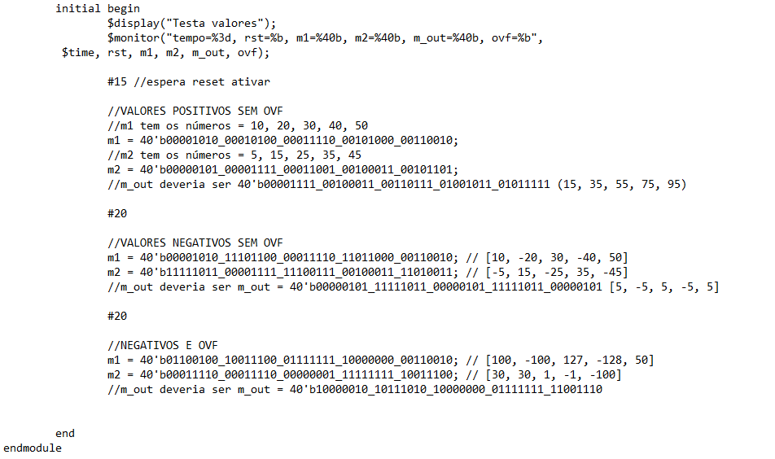         | 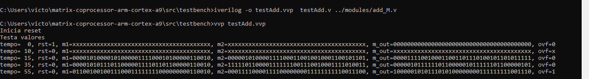     |
| **Subtração**             | 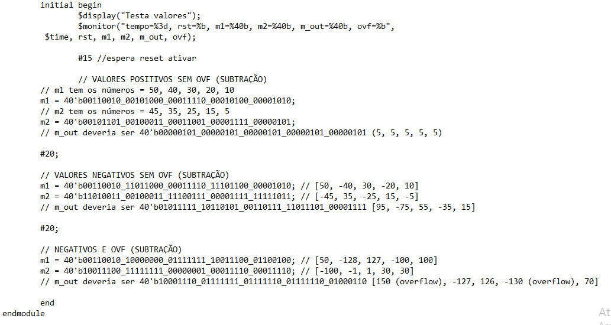         | 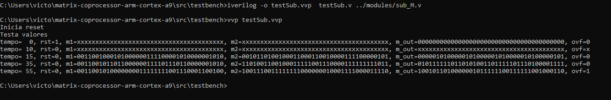     |
| **Mult. entre Matrizes**  | 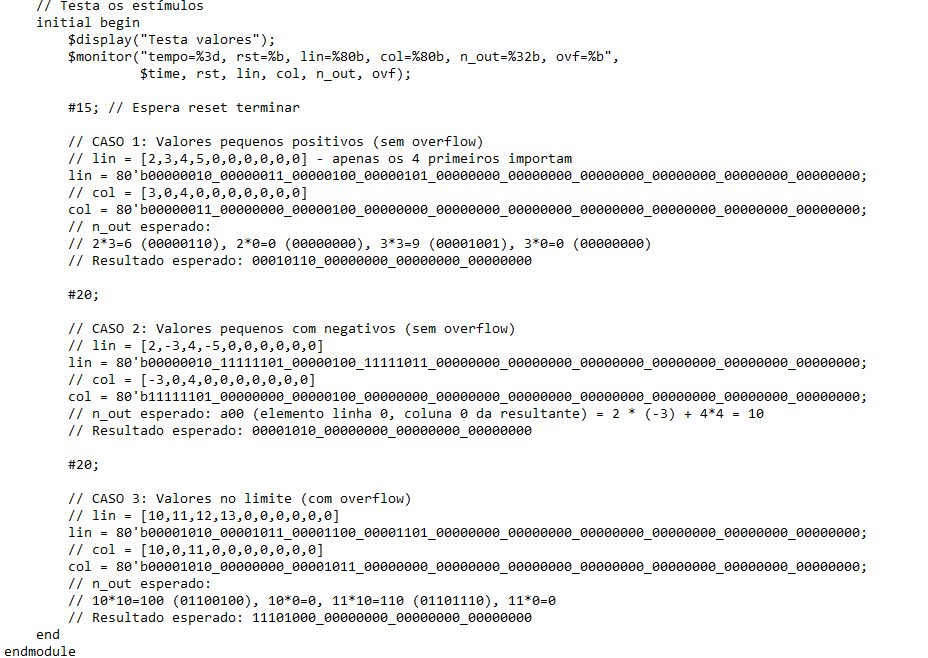   | 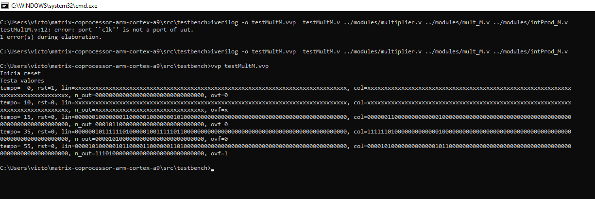 |
| **Mult. por Escalar**     | 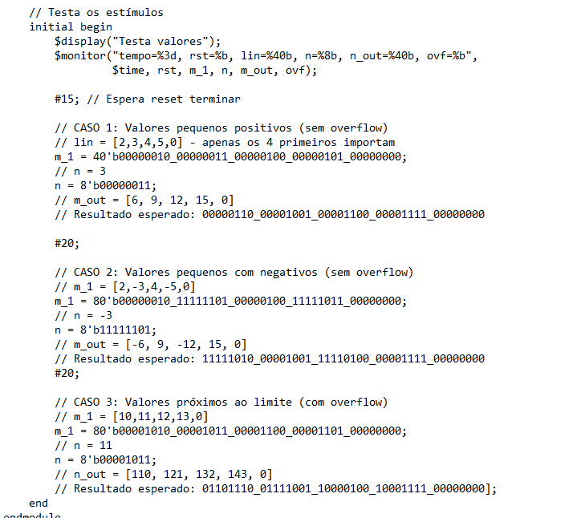   | 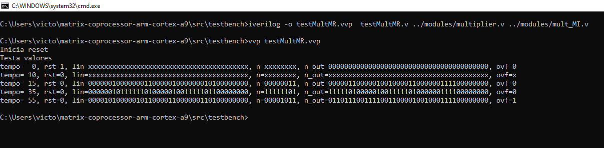 |
| **Determinante 2x2**      | 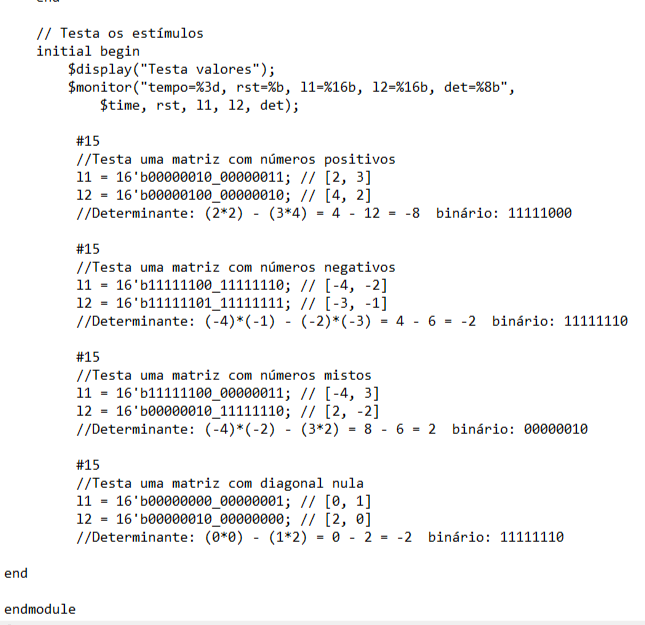       | 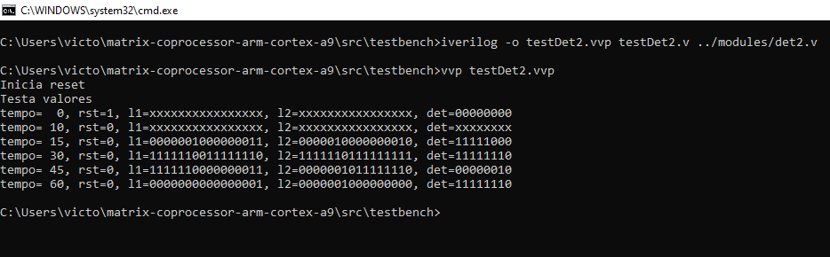   |
| **Determinante 3x3**      | 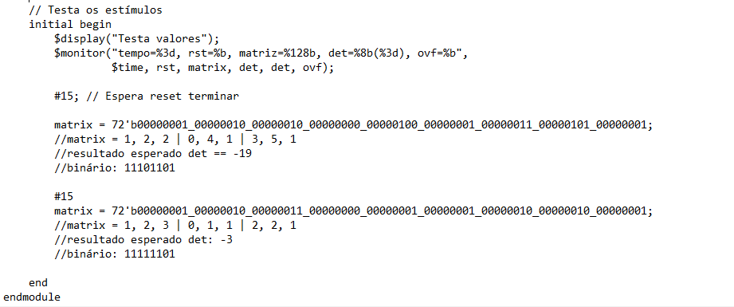       | 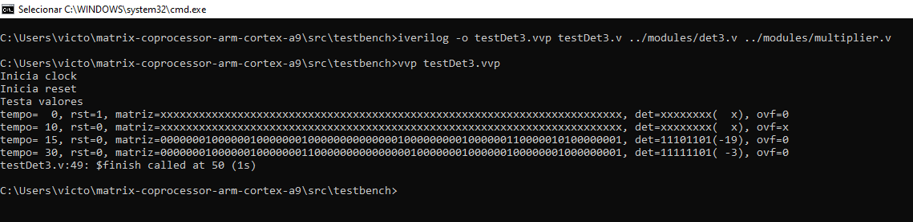   |
| **Determinante 4x4**      | 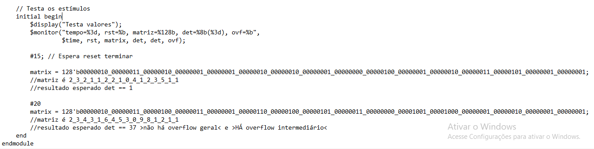       | 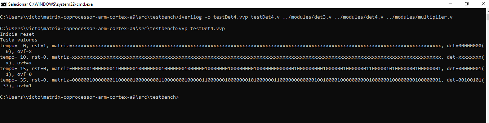   |
| **Determinante 5x5**      | 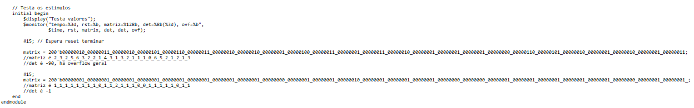       | 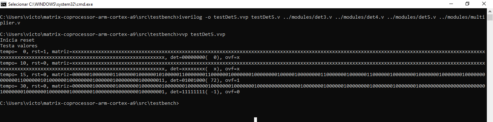   |
| **Oposta**                | 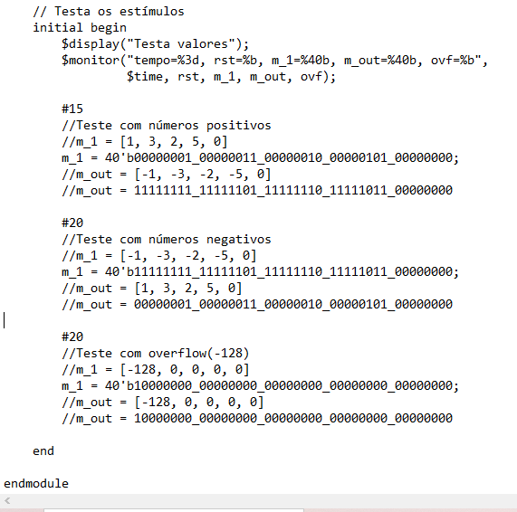         | 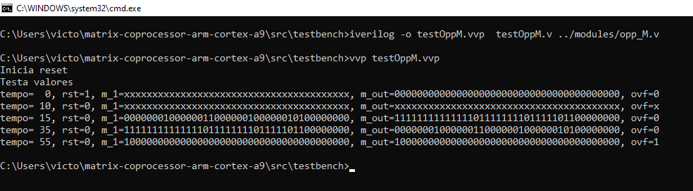     |

### 🧾 Como realizar testes?
Os testes podem ser realizados utilizando o Icarus Verilog, compilador de Verilog que permite a compilação de arquivos `.vvp` de testbench.

Para realizar os testes, basta instalar o compilador [Icarus Verilog](https://github.com/steveicarus/iverilog), escrever um módulo de testbench instanciando a unidade de teste escolhida (ex.: multiplier.v) e preencher os valores desejados, com a função monitor e um intervalo de tempo suficiente entre os diferentes valores. Um guia para escrita de testbench pode ser visto [aqui](https://fpgatutorial.com/how-to-write-a-basic-verilog-testbench/).

Alguns dos testbench realizados durante o desenvolvimento podem ser encontrados em `src/testbench`.

## 🔢 Como utilizar o coprocessador?
Para utilizar o coprocessador, você deverá acessar a ferramenta In-Memory Content Editor do Quartus Prime através de **Tools** > **In-System Memory Content Editor**. Nela, já estará configurada a memória.

Antes de tudo, será necessário enviar o coprocessador compilado para a placa. Para isso, dentro da ferramenta, clique em `...` abaixo de **Scan Chain** e selecione o arquivo `.sof` em `output-files`, na pasta do projeto. Em seguida, clique no primeiro botão após `SOF Manager:`, a opção **Program Device**. Aguarde alguns instantes e a ferramenta estará pronta para escrever.

Como já apontado, a memória da placa está dividida em quatro blocos de `200 bits` cada. O primeiro endereço (`00`), nas duas posições mais à direita da tela, são escritos respectivamente o `op-code` e, em seguida, o `tamanho da matriz`.

No endereço `01`, da esquerda para a direita, é inserida a primeira matriz. A matriz é inserida considerando que cada bloco de 40 bits (ou seja, a cada 5 elementos de 8 bits), é uma nova linha. Inicia-se da linha de cima, seguido da segunda linha, até chegar na última. Serão aceitas **apenas** matrizes n x n, com n<=5. Cada bloco de 5 elementos é uma linha, da esquerda para a direita. Portanto, caso a matriz não seja 5x5, pode-se ignorar os elementos restantes da linha e as linhas restantes, não utilizadas.

No endereço `02`, da esquerda para a direita, é inserida a segunda matriz, da mesma forma que a primeira. Caso, entretanto, a operação envolva apenas uma matriz e um inteiro, o número será escrito na posição mais a direita.

No endereço `03`, será escrita a saída após o estado de `writeback`.

Para se comunicar com a placa, aperte **Shift + F8** e, em seguida, clique na segunda opção após "Instance Manager". Assim, a FPGA estará recebendo qualquer sinal enviado. Basta, então, acionar a chave 00, que corresponde ao `ready` e iniciar o clock com o botão `00`.

## ✅ Conclusão
Diante do detadalhamento de todos os componentes do coprocessador, conclui-se, portanto, que a construção do projeto permitiu a priori uma ótima base teórica do funcionamento e arquitetura de processadores, aplicando conceitos de **máquina de estados** com os 4 estados básicos, uso de **registradores** para armazenar informações temporariamente no coprocessador, e o uso e administração de recursos de **memória**.

As operações previstas ocorrem de maneira satisfatória e de acordo  com os requisitos do problema: **números de 8 bits** com representação de **sinal**, e matrizes **quadradas** de até **5x5**, sinalizando **overflow** quando ocorrerem. Assim como os testes feitos em **testbenchs** e na placa física **DE1_SoC** ofereceram um suporte na **depuração** do código verilog, seja encontrando erros de lógica, de sinais de saída, como overflow ou erros de sincronismo. Sem os testes, uma parte essencial no desenvolvimento de qualquer projeto, seria inviável verificar o funcionamento correto do coprocessador.

Contudo, apesar da grande maioria das operações estarem ocorrendo como previsto e sempre usando **1 ciclo de clock**, uma característica bastante importante, já que reduz o **tempo de resposta** do coprocessador, uma operação apresentou erro em seu resultado: a operação de multiplicação entre matrizes gera uma matriz resultante com erro específico na coluna 4, onde seus elementos não representam os valores reais esperados com base em testes, os outros elementos não apresentam erros. Isso advém de erros no processo de fatiamento das sequências de bits que representam os elementos, o que acarreta um cálculo com elementos distindo para a coluna 4.

Por fim, mesmo o coprocessador realizar operações de modo satisfatório, ainda há possíveis melhorias a serem destacadas:

* Leitura e escrita na memória usando barramento de 8 bits, em vez de usar um único barramento de 200 bits;
* Troca do sinal de mudança de estados usado para testes - que foi o botão 00 da FPGA - para o clock real em Hz;
* Aplicações de **Pipeline**, um tipo de paralelismo que permite que instruções ocorram em paralelo com outras, o que permitiria colocar uma sequência de operações matriciais, em vez de apenas uma por vez a cada fim da máquina de estados;
* Correção da multiplicação entre matrizes no quesito do resultante da coluna 4, que breve será corrigido.

## 📚 Referências
* Patterson, D. A. ; Hennessy, J. L. 2016. Morgan Kaufmann Publishers. Computer organization and design: ARM edition. 5ª edição.
* GEKSFORGEEKS. Co-processor in Computer Architecture. Disponível em: https://www.geeksforgeeks.org/co-processor-computer-architecture/. 

* INTEL CORPORATION. Intel 8087 Numeric Data Processor: User’s Manual. Disponível em: https://datasheets.chipdb.org/Intel/x86/808x/datashts/8087/205835-007.pdf. 

* PANTUZA, J. Organização e arquitetura de computadores: pipeline em processadores. Disponível em: https://blog.pantuza.com/artigos/organizacao-e-arquitetura-de-computadores-pipeline-em-processadores. 

* FPGA TUTORIAL. How to write a basic Verilog Testbench. Disponível em: https://fpgatutorial.com/how-to-write-a-basic-verilog-testbench/.

## 👥 Colaboradores
* **Rian da Silva Santos** -  [Rian](https://github.com/riancmd)
* **Victor Ariel Matos Menezes** - [Victor](https://github.com/VitrolaVT)
* **Edgar Rodrigo Rocha Silva** - [Edgar](https://github.com/Edgardem)
